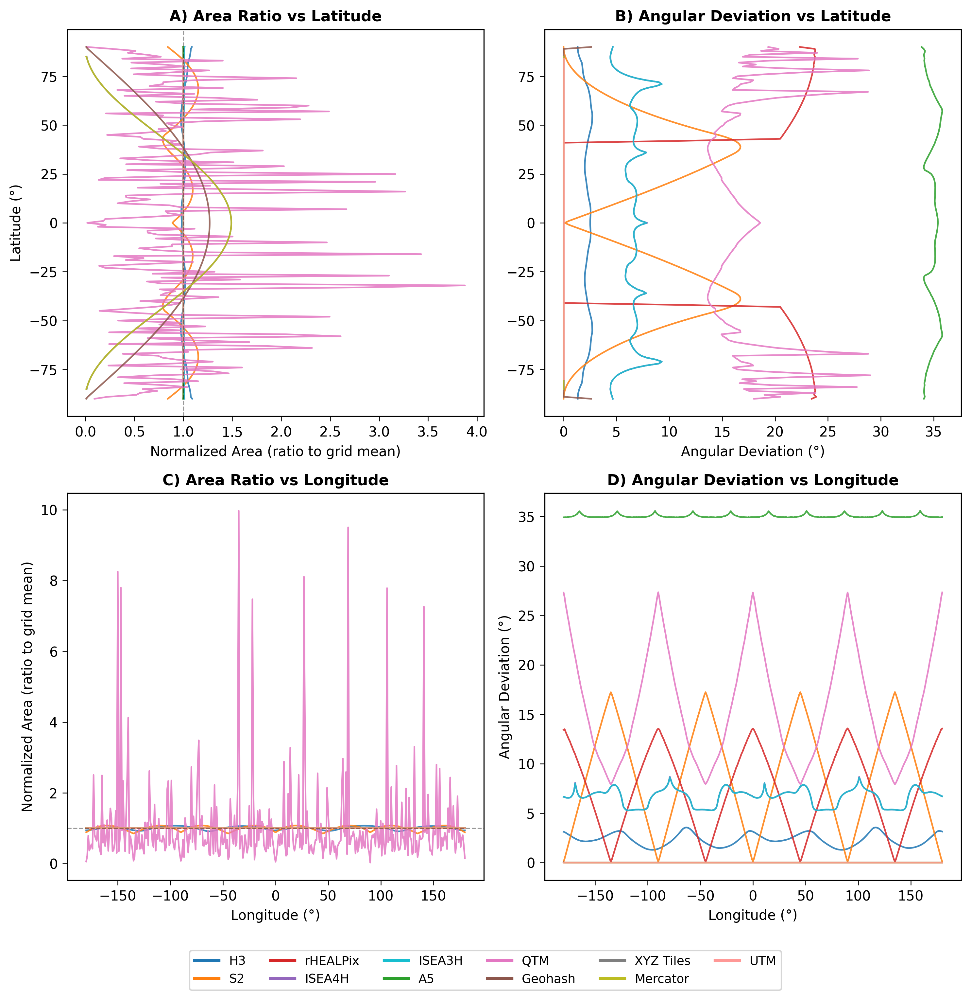
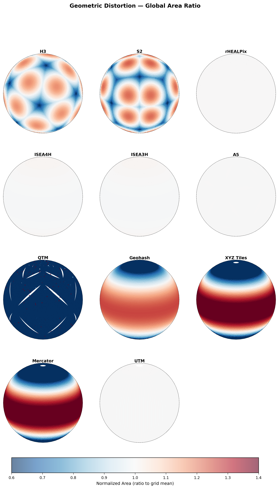
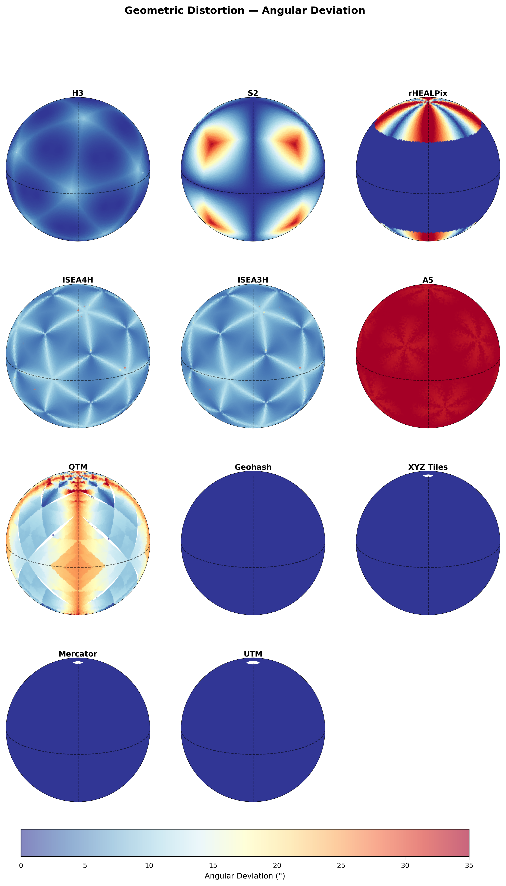
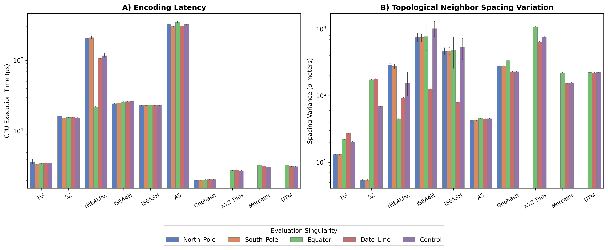

# Reproducing Paper Figures

This guide walks you through generating the figures from the TSAS paper for **any combination** of the 11 supported grid systems.

## Quick Start — Using Pre-Built Data

The fastest path: download the release dataset from OSF and generate figures directly.

```bash
# 1. Download pre-built benchmark results (Exp 1 + Exp 2, all 11 grids)
dggs-bench download-examples

# 2. Generate all figures
python examples/generate_paper_figures.py
```

Figures are saved to `data/tsas_v1/figures/` as both PNG (300 DPI) and PDF.

---

## Running Experiments from Scratch

If you want to regenerate the raw data yourself (e.g. for a new grid you've added), use the CLI:

### Experiment 1: Geometric Distortion

Measures geodetic area variance, shape compactness (ZSC), and angular deviation across 1M globally distributed points.

```bash
# All 11 grids (~15-30 min depending on hardware)
dggs-bench run geometric-distortion --samples 1000000

# Specific grids only
dggs-bench run geometric-distortion --samples 1000000 --grids h3,s2,a5

# Quick test with fewer points
dggs-bench run geometric-distortion --samples 10000 --grids h3,s2
```

### Experiment 2: Topological Resilience

Probes coordinate singularities (poles, date line, antimeridian) measuring k-ring failure rates and neighbor spacing variance.

```bash
# All 11 grids (~10-20 min)
dggs-bench run topological-resilience --samples 1000000

# Specific grids only
dggs-bench run topological-resilience --samples 1000000 --grids h3,s2,a5
```

### Output Formats

All experiments output GeoParquet by default. Add `--output-format parquet,gpkg,csv` for multiple formats:

```bash
dggs-bench run geometric-distortion --samples 10000 --output-format parquet,gpkg
```

---

## Generating Figures

The `generate_paper_figures.py` script reads from the release parquets and produces publication-quality visualizations.

```bash
# Default: reads from data/tsas_v1/release/, saves to data/tsas_v1/figures/
python examples/generate_paper_figures.py

# Custom paths
python examples/generate_paper_figures.py \
    --data-dir data/processed/ \
    --output-dir my_figures/

# Generate for a subset of grids
python examples/generate_paper_figures.py \
    --grids "H3 (Uber),S2 Geometry (Google),A5 (Pentagon / Dodecahedron)"

# Skip globe heatmaps if cartopy is not installed
python examples/generate_paper_figures.py --skip-cartopy
```

### Generated Figures

| Figure | Filename | Experiment | Description |
|---|---|---|---|
| Lat/Lon profiles | `area_angular_profiles` | Exp 1 | 2×2 grid: area ratio and angular deviation vs latitude/longitude |
| Globe area heatmap | `globe_area_distortion` | Exp 1 | Orthographic projections of area distortion per grid |
| Globe angular heatmap | `globe_angular_distortion` | Exp 1 | Orthographic projections of angular deviation per grid |
| Summary table | `geometric_summary.csv` | Exp 1 | Area CV%, mean angular deviation, ZSC per grid |
| Resilience bars | `topological_resilience` | Exp 2 | Encoding latency and spacing variance by region |

### Dependencies

```bash
pip install pandas matplotlib seaborn numpy

# For globe heatmap figures (optional):
pip install cartopy
```

---

## Results Overview

The figures below are generated from the pre-built 11-grid release dataset (1M sample points per grid, Fibonacci sphere distribution). All area measurements use geodetic computation on the WGS84 ellipsoid.

### Geometric Summary

| Grid | Area CV (%) | Mean Angular Dev (°) | ZSC | Cells |
|---|---:|---:|---:|---:|
| H3 | 12.47 | 2.32 | 0.951 | 1,000,000 |
| S2 | 14.63 | 8.87 | 0.877 | 1,000,000 |
| rHEALPix | 0.001 | 7.33 | 0.868 | 1,000,000 |
| ISEA4H | 0.40 | 6.66 | 0.947 | 1,000,000 |
| ISEA3H | 0.40 | 6.65 | 0.947 | 1,000,000 |
| A5 | 0.009 | 35.04 | 0.864 | 1,000,000 |
| QTM | 6,020 | 15.95 | 0.755 | 859,348 |
| Geohash | 28.16 | 0.003 | 0.852 | 1,000,000 |
| XYZ Tiles | 44.02 | 0.013 | 0.886 | 996,272 |
| Mercator | 44.02 | 0.003 | 0.886 | 996,272 |
| UTM | 0.07 | 0.0001 | 0.886 | 989,663 |

**Area CV** — coefficient of variation of geodetic cell area across the globe (lower = more uniform). **ZSC** — Zone Standardized Compactness, the ratio of a cell's perimeter to that of an equal-area spherical cap (1.0 = perfect circle).

### Area and Angular Profiles

Normalized cell area and angular deviation plotted against latitude and longitude. Each line represents one grid system.



### Globe Area Distortion

Orthographic projections showing the spatial distribution of normalized area (ratio to each grid's mean cell area). Blue indicates cells smaller than the grid mean; red indicates cells larger.



### Globe Angular Distortion

Orthographic projections showing angular deviation — the standard deviation of interior vertex angles within each cell. Higher values indicate greater shape deformation across the globe.



### Topological Resilience

Encoding latency and neighbor spacing variance measured at five geographic singularity types: poles, equator, antimeridian, prime meridian, and interior baseline.



---

## Adding a Custom Grid

If you've implemented a custom grid using the [Custom Grid Developer Guide](../docs/custom_grids.md), you can generate figures that include it:

1. **Run experiments** with your grid alias:
   ```bash
   dggs-bench run geometric-distortion --samples 1000000 --grids my_grid
   dggs-bench run topological-resilience --samples 1000000 --grids my_grid
   ```

2. **Merge with existing data** (optional):
   ```python
   import pandas as pd
   
   existing = pd.read_parquet('data/tsas_v1/release/geometric_distortion.parquet')
   new_grid = pd.read_parquet('data/processed/geometric_distortion_TIMESTAMP.parquet')
   merged = pd.concat([existing, new_grid], ignore_index=True)
   merged.to_parquet('data/tsas_v1/release/geometric_distortion.parquet')
   ```

3. **Add your grid** to the color palette in `generate_paper_figures.py`:
   ```python
   GRID_COLORS['My Custom Grid'] = '#hexcolor'
   GRID_SHORT['My Custom Grid'] = 'MyGrid'
   GRID_ORDER.append('My Custom Grid')
   ```

4. **Regenerate figures**:
   ```bash
   python examples/generate_paper_figures.py
   ```

---

## Special Notes

### ISEA3H / ISEA4H Bridge

These grids require a pre-compiled C++ shared library (`isea3h_bridge.so` / `isea4h_bridge.so`). The pre-built binaries are included for Linux x86_64. On other platforms, rebuild from source:

```bash
cd src/dggs_benchmark/grids/dglib_bridge/
./build.sh
```

See [DGGRID Bridge Documentation](../docs/isea3h_dglib_bridge.md) for full details.

### Experiment 3: Computational Throughput

The computational throughput experiment (10M points × 3 iterations) is intentionally excluded from this guide. It requires significant compute time (hours per grid) and measures hardware-dependent latencies that vary across machines. The pre-built release dataset on OSF includes results for the 6 paper grids.

### Experiment 4: Relational Throughput

The relational throughput experiment requires the 10M-point Foursquare OS Places dataset, DuckDB, and multi-scale geographic boundary sweeps. It cannot be reproduced quickly. Use the pre-built release data for these figures.
